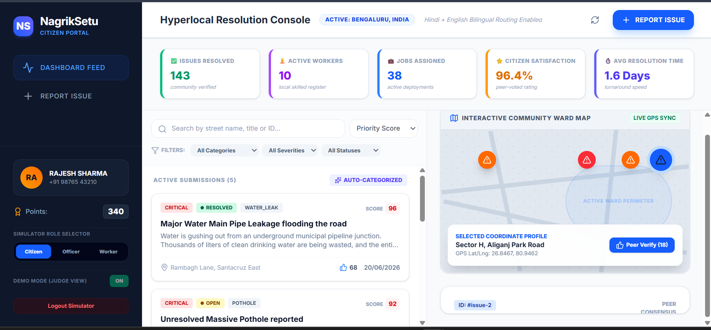
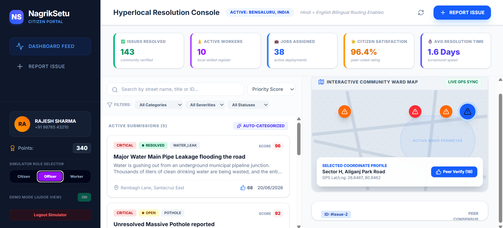
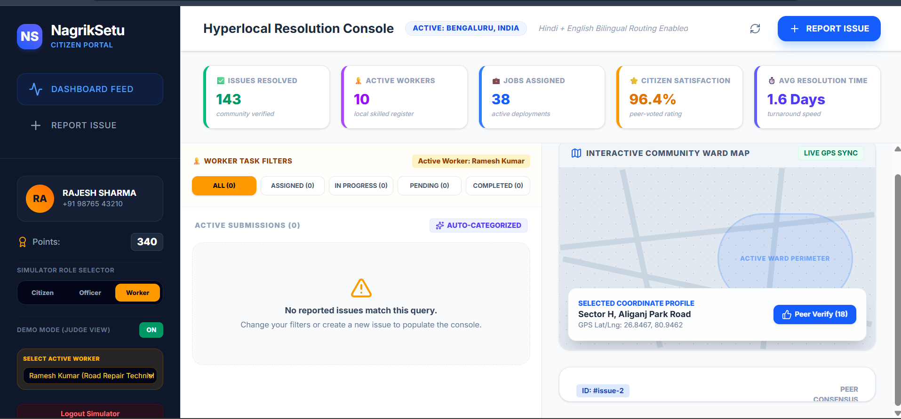
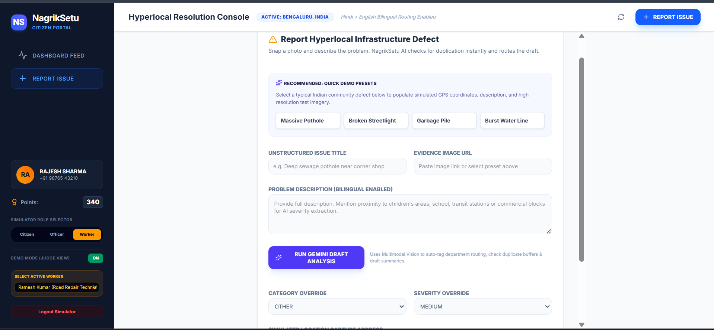
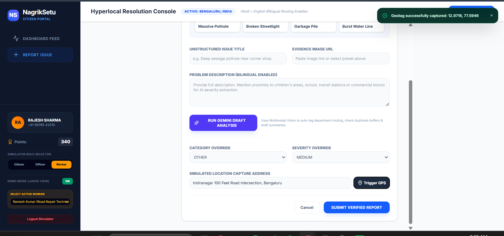

# NagrikSetu – Hyperlocal Community Issue Resolution Platform

## Problem Statement

Communities frequently face infrastructure issues such as potholes, water leakages, broken streetlights, waste accumulation, drainage failures, and other civic problems. Reporting these issues is often fragmented, difficult to track, and lacks transparency.

NagrikSetu bridges the gap between citizens, municipal authorities, and field workers by providing a transparent, AI-powered issue reporting and resolution ecosystem.

---

## Live Demo

**Deployed Application:**  
https://nagriksetu-812408830274.asia-southeast1.run.app

---

## GitHub Repository

Add your GitHub repository link here:

```text
https://github.com/saksham6541/NagrikSetu
```

---

# Solution Overview

NagrikSetu is an AI-powered hyperlocal civic issue management platform that enables:

- Citizens to report issues with images and location data.
- AI-assisted categorization and severity prediction.
- Municipal Officers to monitor, prioritize, and assign tasks.
- Skilled local workers to receive assignments and submit proof of work.
- Community-driven verification before closure.
- Transparent lifecycle tracking from reporting to resolution.

The platform introduces a collaborative civic workflow where community participation, municipal governance, and local workforce engagement work together to solve infrastructure issues faster.

---

# Key Innovation

Most civic complaint platforms stop after issue reporting.

NagrikSetu extends the workflow by introducing a workforce allocation layer where:

1. Citizens report issues.
2. Municipal Officers review and assign tasks.
3. Verified skilled workers resolve issues.
4. GPS-tagged evidence is submitted.
5. Citizens verify the resolution.
6. Community trust and accountability increase.

This creates a transparent issue-to-resolution ecosystem.

---

# Core Features

## Citizen Portal

- Report civic issues
- Upload evidence photos
- AI-assisted issue analysis
- GPS location capture
- Issue tracking
- Community upvoting
- Resolution verification
- Reputation points system

---

## AI-Powered Categorization

Using Gemini:

- Issue classification
- Department routing
- Severity estimation
- Priority scoring
- Duplicate detection
- Draft issue analysis

Supported categories:

- Potholes
- Water Leakage
- Streetlights
- Garbage
- Drainage
- Public Safety
- Others

---

## Municipal Officer Dashboard

Authorities can:

- Monitor city-wide issues
- Review issue severity
- Change priority levels
- Assign workers
- Track progress
- View analytics
- Handle escalations
- Review citizen feedback

---

## Worker Management System

Field workers can:

- View assigned jobs
- Update work status
- Submit completion reports
- Upload before/after evidence
- Submit GPS proof-of-work
- Respond to rework requests

---

## Community Verification Workflow

After a worker completes a task:

1. Evidence is uploaded
2. GPS location is captured
3. Citizen reviews completion
4. Citizen approves or rejects

Approved:

- Issue closed
- Reputation awarded

Rejected:

- Issue reopens
- Rework request generated
- Escalation tracking activated

---

## GPS Verification

Features:

- Location capture
- GPS proof-of-work
- Resolution timestamp
- Verification badge
- Accountability tracking

---

## Gamification

### Citizens

Earn points for:

- Reporting issues
- Verification actions
- Community participation

### Workers

Earn:

- Skill points
- Successful resolutions
- Community trust score

---

# System Workflow

```text
Citizen Reports Issue
          │
          ▼
 Gemini AI Analysis
          │
          ▼
Municipal Officer Review
          │
          ▼
Worker Assignment
          │
          ▼
Field Resolution
          │
          ▼
Evidence + GPS Upload
          │
          ▼
Citizen Verification
          │
          ▼
Issue Closed
```

---

# Screenshots

## Citizen Dashboard



The citizen portal provides real-time visibility into active civic issues, community participation metrics, AI categorization, and issue resolution tracking.

---

## Municipal Officer Dashboard



Municipal officers can monitor reported issues, adjust priorities, assign workers, and oversee the entire resolution lifecycle.

---

## Worker Dashboard



Field workers receive assignments, update task progress, submit completion reports, and upload evidence.

---

## AI-Assisted Issue Reporting



Citizens can submit civic complaints using AI-assisted categorization, multilingual descriptions, and severity prediction.

---

## GPS Verification Workflow



GPS-backed reporting and verification improve accountability and ensure location-authenticated issue management.

---

---

# Technology Stack

## Frontend

- React
- TypeScript
- Tailwind CSS
- Vite

## Backend

- Node.js
- Express.js

## AI

- Google Gemini API
- Google AI Studio

## Deployment

- Google Cloud Run

---

# Google Technologies Used

### Google AI Studio

Used for:

- AI-assisted issue analysis
- Categorization
- Severity estimation
- Workflow prototyping

### Gemini API

Used for:

- Natural language processing
- Issue classification
- Intelligent routing
- Draft generation

### Google Cloud Run

Used for:

- Production deployment
- Public application hosting
- Scalable backend execution

---

# Future Scope

## Verified Skilled Worker Registry

Allow:

- Electricians
- Plumbers
- Welders
- Road Repair Technicians
- Sanitation Workers

to register and receive municipal work assignments.

---

## Digital Skill Verification

Future integration with:

- Government skill databases
- Digital certificates
- Trade licenses
- Aadhaar-based verification

---

## Predictive Infrastructure Maintenance

Use AI and historical reports to:

- Predict failures
- Detect hotspots
- Recommend preventive actions

---

## Smart City Integration

- Municipal ERP integration
- GIS integration
- IoT sensors
- Smart street infrastructure

---

# Impact

NagrikSetu creates:

- Faster civic issue resolution
- Greater transparency
- Increased community participation
- Better municipal accountability
- Opportunities for skilled local workers
- Trust between citizens and authorities

---

# Team

**Saksham Kaushik**

B.Tech Computer Science Engineering  
GL Bajaj Institute of Technology and Management

IIT Madras BS in Data Science and Applications

---

# License

This project was developed as part of a Hackathon submission and is intended for educational and demonstration purposes.