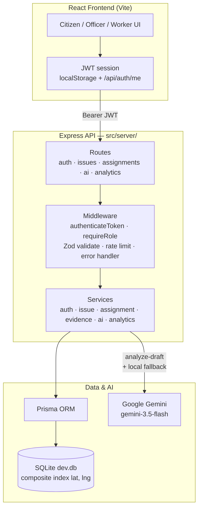

# NagrikSetu

**Bridging citizens and municipal authorities through transparent, AI-assisted civic issue resolution.**

NagrikSetu is an open-source civic-tech platform that helps residents report local infrastructure problems (potholes, streetlights, garbage, water leaks, and more), build community consensus through upvotes, and track resolution in real time. Municipal officers and field workers get role-based dashboards to triage, assign, verify, and close work—backed by JWT auth, Prisma-backed persistence, and Gemini-powered draft analysis.

[](https://www.typescriptlang.org/)
[](https://react.dev/)
[](https://vitejs.dev/)
[](https://expressjs.com/)
[](https://www.prisma.io/)
[](https://www.sqlite.org/)
[](https://zod.dev/)
[](LICENSE)

---

## Architecture


```mermaid
flowchart TB
  subgraph Client["React Frontend (Vite)"]
    UI["Citizen / Officer / Worker UI"]
    AuthState["JWT session<br/>localStorage + /api/auth/me"]
  end

  subgraph API["Express API — src/server/"]
    Routes["Routes<br/>auth · issues · assignments · ai · analytics"]
    MW["Middleware<br/>authenticateToken · requireRole<br/>Zod validate · rate limit · error handler"]
    Services["Services<br/>auth · issue · assignment · evidence · ai · analytics"]
  end

  subgraph Data["Data & AI"]
    Prisma["Prisma ORM"]
    SQLite[("SQLite dev.db<br/>composite index lat, lng")]
    Gemini["Google Gemini<br/>gemini-3.5-flash"]
  end

  UI --> AuthState
  AuthState -->|"Bearer JWT"| Routes
  Routes --> MW
  MW --> Services
  Services --> Prisma
  Prisma --> SQLite
  Services -->|"analyze-draft<br/>+ local fallback"| Gemini
```

**Request path (authenticated):** React → `Authorization: Bearer <token>` → route → Zod body validation → auth/role middleware → service → Prisma transaction → JSON response. Errors surface through a single Pino-backed error handler (validation → `400`, auth → `401`/`403`, domain conflicts → `409`).

---

## Core Features

### Citizens
- Register and sign in with **phone + OTP** (OTP simulated as `123456` in development)
- Report infrastructure issues with location, photos, and optional AI-assisted draft analysis
- Upvote and comment; identity is taken from the JWT (not the request body)
- Track status history, evidence, and community verification rates

### Officers / Admins
- Sign in with **email + password**
- Review queues, update issue status, and route to departments
- Assign field workers; actions are recorded in status history with the officer’s name from the session

### Workers
- Staff login; view **my assignments**
- Accept → in-progress → completed transitions with validated state machine
- Upload before/after evidence tied to the authenticated user

### Platform
- JWT auth with role guards (`CITIZEN` | `OFFICER` | `WORKER` | `ADMIN`)
- Geospatial duplicate hints via bounding-box queries on indexed `lat`/`lng`
- AI classification and routing suggestions via **Gemini 3.5 Flash**, with deterministic local fallback when the API key is absent
- Pagination on issue lists; atomic Prisma transactions for create / vote / assign / status flows

---

## Tech Stack

| Layer | Tools |
|--------|--------|
| **Frontend** | React 19, TypeScript, Vite 6, Tailwind CSS 4, Lucide icons |
| **Backend** | Node.js, Express 4, TypeScript (`tsx` in dev) |
| **Auth** | JSON Web Tokens (`jsonwebtoken`), bcryptjs for staff passwords |
| **Validation** | Zod schemas on critical request bodies |
| **Logging** | Pino (+ pino-pretty in development) |
| **ORM / DB** | Prisma 6 → SQLite for local zero-config (`file:./dev.db`); schema ready to switch to PostgreSQL for production |
| **AI** | `@google/genai` · model `gemini-3.5-flash` |
| **Tests** | Vitest + Supertest |
| **Tooling** | ESBuild for production server bundle |

---

## Local Setup

### Prerequisites
- **Node.js** 20+ (recommended)
- Optional: a [Google AI Studio](https://aistudio.google.com/) API key for live Gemini analysis

### Steps

```bash
# 1. Clone and install
git clone <your-fork-or-repo-url> NagrikSetu
cd NagrikSetu
npm install

# 2. Environment
cp .env.example .env
# Edit .env if needed. Defaults for local SQLite:
#   DATABASE_URL="file:./dev.db"
#   JWT_SECRET="…change in production…"
#   GEMINI_API_KEY="MY_GEMINI_API_KEY"   # leave placeholder to use local AI fallback

# 3. Database
npm run prisma:generate
npm run prisma:push

# 4. Demo data (optional; server also auto-seeds an empty DB)
npm run seed

# 5. Run
npm run dev
```

Open **http://localhost:3000**.

### Demo credentials

| Role | Login | Credential |
|------|--------|------------|
| **Citizen** | Phone `+919876543210` | OTP `123456` |
| **Officer** | `vignesh.officer@bbmp.gov.in` | `changeme123` |
| **Worker** | `ramesh.worker@bbmp.gov.in` | `changeme123` |

### Useful scripts

```bash
npm run dev          # API + Vite middleware on :3000
npm run lint         # tsc --noEmit
npm test             # Vitest (auth, validation, vote dedup, AI fallback)
npm run prisma:generate
npm run prisma:push
npm run seed
npm run build        # Vite client + bundled server
npm start            # production server from dist/
```

### Production database

In `prisma/schema.prisma`, set `provider = "postgresql"` and point `DATABASE_URL` at your instance (e.g. Cloud SQL). Then regenerate and migrate/push as usual.

---

## Project Structure

```
NagrikSetu/
├── prisma/
│   ├── schema.prisma      # User, Issue, Upvote, Comment, StatusHistory,
│   │                      # WorkerAssignment, EvidenceUpload, AIAnalysisResult
│   └── seed.ts            # Demo citizen / officer / worker + sample issues
├── src/
│   ├── App.tsx            # React UI (JWT session, role-aware dashboards)
│   ├── types.ts           # Shared domain enums & interfaces
│   ├── db.ts              # Prisma client singleton
│   └── server/            # Modular Express backend (≤ ~200 lines per file)
│       ├── index.ts       # Process entry, Vite middleware, listen
│       ├── app.ts         # createApp() — mount routes & static uploads
│       ├── lib/           # config, utils/formatters, pino logger
│       ├── middleware/    # auth, Zod validate, rate limit, errors
│       ├── schemas/       # Zod request schemas
│       ├── services/      # Business logic (auth, issues, AI, analytics, …)
│       └── routes/        # HTTP wiring only
├── tests/                 # Vitest + Supertest
├── server.ts              # Thin shim → src/server/index.ts
├── package.json
├── vitest.config.ts
└── MIGRATION_NOTES.md     # Backend rework changelog
```

---

## API overview (selected)

| Method | Path | Auth | Notes |
|--------|------|------|--------|
| `POST` | `/api/auth/register` | — | Citizen signup (Zod) |
| `POST` | `/api/auth/login` | — | Request OTP |
| `POST` | `/api/auth/verify-otp` | — | Issue JWT |
| `POST` | `/api/auth/login-staff` | — | Officer/worker email + password |
| `GET` | `/api/auth/me` | Bearer | Restore session |
| `GET` | `/api/issues` | — | List (optional `?page=&limit=`) |
| `POST` | `/api/issues` | Citizen | Create issue |
| `POST` | `/api/issues/:id/vote` | Any user | Deduped by `(issueId, voterIdentifier)` |
| `POST` | `/api/issues/:id/status` | Officer/Admin | Status + optional department |
| `POST` | `/api/issues/:id/assign-worker` | Officer/Admin | Create assignment |
| `POST` | `/api/ai/analyze-draft` | Optional | Rate-limited; Gemini or local rules |
| `GET` | `/api/analytics` | — | Metrics, departments, hotspots |

Identity fields such as reporter name, comment author, and `updatedBy` are **derived from the JWT** on the server; client-supplied identity on those routes is ignored.

---

## Testing

```bash
npm test
```

Coverage includes unauthenticated rejection, citizen-vs-officer role checks, Zod `400` responses on malformed bodies, upvote uniqueness (`409`), and the local AI analysis fallback path.

---

## Contributing

Contributions are welcome—bug fixes, new municipal workflows, stronger OTP providers (e.g. MSG91/Twilio), PostgreSQL deployment guides, and UI accessibility improvements.

1. Fork the repository and create a feature branch.
2. Keep changes focused; prefer extending `src/server/services` and Zod schemas over growing route files.
3. Run `npm run lint` and `npm test` before opening a pull request.
4. Do not commit secrets; keep `.env` gitignored. Document any new env vars in `.env.example`.

Please open an issue first for larger architectural proposals so we can align on scope.

---

## License

Licensed under the **Apache License 2.0**. See the license header in source files and the project `LICENSE` file when present.

---

## Acknowledgments

Built for transparent, hyperlocal civic resolution. Inspired by the everyday friction between residents and municipal systems—and by the idea that better software can make that friction visible, measurable, and solvable.
